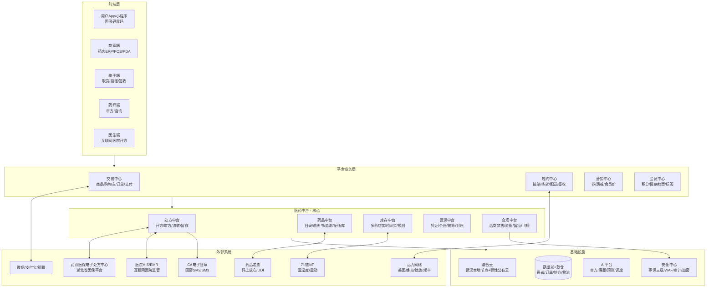

# M7 武汉医药O2O数字化与技术架构

> 模块：M7-digital | 角色：软件架构师（Executor） | 框架：MAF v2.3 + MEA
> 任务时间：2026-08-10 | 输出路径：modules/M7-digital.md
> 上游约束：M1 武汉O2O在营药店约4100家、2025年GMV约26亿；M3 合规要求（电子处方/药师审方/处方留存≥15年/等保三级/麻精毒放禁售/医保电子凭证）。
> 数据访问时间：除特别标注外均为 2026-08-10。

---

## 1. 摘要与核心技术结论

武汉作为中部医疗资源高地（三甲31家、三级84家、卫生机构6725家；SSOT），叠加2024年12月30日医保电子处方中心全面上线、29家慢特病定点药店、"双通道"电子处方流转等政策窗口，正进入医药O2O的"合规+平台化"深化阶段。本章从软件架构师视角，给出武汉医药O2O平台的目标技术架构与落地路径，核心结论如下：

1. **必须以"医药中台"为核心，而非简单电商系统**。通用电商中台不能直接套用，必须沉淀处方、药品、库存、医保、合规五个医药特有的业务中台，并与武汉医保电子处方中心、HIS、互联网医院、GSP/追溯码、医保结算等外部系统打通。
2. **电子处方流转是整个架构的"主动脉"**。武汉2025年1月1日起"双通道"与"单独支付"药品必须经医保电子处方中心流转、不再接受纸质处方（长江日报，2024-12-30，https://cjrb.cjn.cn/h5/html5/2024-12/30/content_151736_1696694.htm；湖北省医保局鄂医保办〔2024〕32号，访问时间2026-08-10）。平台必须具备HIS对接、CA电子签章、处方真实性校验、处方中台、药师在线审方、调剂配送回写、用药随访、15年留存等完整链路。
3. **医保线上支付是GMV放大器但风控要求极高**。根据SSOT，全国医保线上化已覆盖40城（2026-04），医保订单客单价平均提升47%。武汉需对接医保电子凭证、个账、门诊统筹、慢特病/双通道结算，并支持医保智能监控、飞检风控、对账与差错处理。
4. **AI是效率层而非决策层**。监管已明确"严禁使用人工智能等自动生成处方"（湖南省医保局2025年3月通知，http://ybj.yzcity.gov.cn/ybj/0204/202503/c09b9bf10fc2470dbf29d35b001bdcc8.shtml，访问时间2026-08-10）。AI只能用于辅助审方、合理用药提醒、客服、库存预测、骑手调度、智能荐药等"辅助决策"，处方与诊疗最终责任仍归执业医师/药师。
5. **等保2.0三级 + 医疗数据分级分类 + 数据本地化是硬性门槛**。医疗数据涉及《个保法》敏感个人信息（健康数据），必须单独同意、加密、脱敏、访问审计、留痕；2025年10月1日施行的《湖北省数据条例》对数据本地化与安全评估提出更高要求（与M3合规章节一致）。
6. **武汉本地化应优先复用九州通等龙头的既有数字化资产**。九州通总部位于武汉汉阳，2025H1营收811.06亿元、好药师门店31535家、O2O门店超5600家覆盖200余城、已上线"门店通"O2O接单、三码合一库、与阿里健康合作BC一体仓（九州通2025半年报，https://money.finance.sina.com.cn/corp/view/vCB_AllBulletinDetail.php?stockid=600998&id=11375455，访问时间2026-08-10），是武汉平台可直接对接或合作的关键基础设施。

本章所有具体数字与供应商事实均附URL与访问时间，未编造产品名或参数；明确区分"成熟商用"与"概念探索"。

---

## 2. 医药O2O数字化全景架构

### 2.1 分层架构

武汉医药O2O平台目标架构采用"五端 + 四中台 + 两基础设施"的分层模式：

- **前端层**：用户App/小程序、商家端（药店ERP/POS）、骑手端、药师端、医生端（互联网医院）。
- **平台业务层**：交易（商品/购物车/订单/支付）、履约（接单/拣货/配送/签收）、营销（券/满减/会员价）、会员（积分/标签/慢病档案）。
- **医药中台层（本架构核心）**：处方中台、药品中台、库存中台、医保中台、合规中台。
- **基础设施层**：混合云（武汉本地节点为主）、网络（专线/VPC/抗D）、安全（等保三级/WAF/数据库审计）、数据（数据湖+数仓+BI+AI平台）。
- **外部对接层**：武汉医保电子处方中心、湖北省医保信息平台、HIS/EMR、互联网医院监管平台、药品追溯（码上放心/UDI）、CA电子签章、银联/微信/支付宝、地图/骑手运力（美团、蜂鸟、达达、顺丰同城、京东到家）、短信/人脸核身、冷链IoT。

### 2.2 架构图（mermaid）



### 2.3 各层关键设计

**前端层**：用户端必须支持医保电子凭证展码、处方上传/拍照、视频问诊、用药提醒、冷链签收；商家端必须支持GSP进销存、处方核验、药师在岗打卡、追溯码扫码、医保结算；骑手端必须支持药品专包、温控拍照、签收凭证（身份证/人脸）、隐私号；药师端支持24h排班、审方工作台、用药咨询、电子签名；医生端需通过实体二级以上医院互联网医院资质接入（与M3监管一致）。

**平台业务层**：在标准电商能力之上，订单类型必须区分OTC、处方药、双通道、慢特病、冷链、毒麻精放（禁止上架），并在下单前走处方校验与医保资格校验；履约需支持"到店自提+30分钟送达+次日达+冷链专送"多模式；营销必须对处方药、医保商品做严格限制（不得对处方药进行满减/折扣诱导，与M3一致）。

**医药中台层**详细设计见后续章节。

**基础设施层**：建议武汉本地至少2个可用区（如光谷+汉口），核心数据库与处方/医保数据本地化部署，非敏感业务（商品、营销、日志分析）可使用阿里云/华为云/腾讯云的武汉Region弹性资源。参考九州通与华为云合作历史（华为云公开案例，2018年发布，https://www.huaweicloud.com/journal/detail_11.html，访问时间2026-08-10；其中拣货30000步→20000步出头、车辆派送实验室提升近5倍等数字为2018年案例数据，非当前实时数据），其在武汉东西湖物流中心已使用华为云EI做储位优化、OCR票据识别、路径规划——可作为同类项目的能力基线参考。


---

## 3. 电子处方流转架构（核心）

### 3.1 业务全链路

武汉医药O2O的电子处方必须覆盖完整闭环：

```
医生开方（互联网医院/HIS）
  → CA电子签章（医师CA + 医院CA）
  → 上传武汉医保电子处方中心
  → 药师前置审核（AI辅助 + 执业药师）
  → 处方中台分发（患者自选药店 / 平台按库存+距离推荐）
  → 药店接单（核验处方真伪、医师资质、患者身份）
  → 调配（拣货、复核、追溯码扫码）
  → 医保结算（医保电子凭证 + 个账/统筹/慢特病）
  → 骑手配送（药品专包、冷链、签收凭证）
  → 用药随访（执业药师 24-72h 回访）
  → 处方留存 ≥ 15 年（区块链/对象存储 WORM）
  → 状态回写医保电子处方中心 / 医院HIS
```

国家医保局《医疗保障信息平台电子处方中心技术规范》（2023年12月）规定了医保电子处方中心的统一架构，渠道应用需通过医保电子凭证中心、统一认证中心、移动支付中心进行接入（国家医保局技术规范PDF，https://file.m12333.cn/upfile/download/03d4a36f-dce6-d785-ec00-a794eb803fcd.pdf，访问时间2026-08-10）。湖北省医保局2024年11月29日发布的鄂医保办〔2024〕32号文进一步明确：
- "双通道"及"单独支付"药品自2025年1月1日起必须通过医保电子处方中心流转，不再接受纸质处方；
- 门诊慢特病用药自2025年7月1日起电子处方流转；
- 门诊统筹基金支付药品自2025年11月1日起电子处方流转；
- 处方外配原则上限定本统筹地区定点医疗机构，2025年1月1日起原则上不再接受统筹区外处方；
- 电子处方存档备查，纸质处方保存≥2年（医保要求），平台按更高的15年标准留存以满足《医疗机构病历管理规定》和M3合规约束。
（来源：武汉市医保局转载鄂医保办〔2024〕32号，https://ybj.wuhan.gov.cn/zwgk_52/zcfgyjd/qtzdgkwj/202502/t20250225_2539139.shtml，访问时间2026-08-10）

长江日报2024-12-30《医保电子处方全面上线》同步确认武汉医保电子处方中心已全面上线（https://cjrb.cjn.cn/h5/html5/2024-12/30/content_151736_1696694.htm，访问时间2026-08-10）。

### 3.2 处方中台模块设计

处方中台是本架构最核心、最不能用通用电商组件替代的模块，建议包含以下子域：

| 子域 | 关键能力 | 关键技术 |
|------|---------|---------|
| 处方接入 | 对接HIS（HL7/FHIR/Webservice）、互联网医院API、纸质处方OCR+人工复核 | FHIR R4、ESB、OCR（PaddleOCR/腾讯云OCR） |
| 处方校验 | 医师资质、处方编号唯一性、患者实名、诊断与药品匹配、剂量/疗程、麻精毒放拦截 | 规则引擎（Drools/Aviator）+ 合理用药知识库 |
| 电子签章 | 医师CA签名 + 药师CA签名 + 平台存证 | 国密SM2/SM3、CFCA/北京CA/湖北CA、区块链存证（百度超级链/蚂蚁链/长安链） |
| 处方流转 | 对接医保电子处方中心、外配处方分发、状态机管理 | 状态机（Spring StateMachine）、幂等、分布式事务（Seata/TCC） |
| 药师审方 | 排班、抢单/派单、AI预审、复审、干预记录、与医生实时沟通 | 长连接（WebSocket）、AI临床助手（腾讯健康ACA等） |
| 处方留存 | 原文PDF + 结构化数据 + 签章 + 操作日志，WORM存储≥15年 | 对象存储（OSS/COS/OBS）+ WORM、冷热分层、区块链存证hash |
| 处方监管 | 向省/国家医保监管平台、药监、卫健委上报 | 医保10101/10201接口、药监追溯接口 |

### 3.3 真实性、一人一方与15年留存

- **真实性**：处方必须由医保医师在HIS或合规互联网医院系统中开具，医师CA签名+医院电子签章；处方中台对处方编号、医师编码、医保医师备案状态进行强校验；任何"AI自动生成处方"严格禁止（M3约束、湖南案例可作监管口径参考）。
- **一人一方**：患者实名+医保电子凭证+人脸核身（腾讯云慧眼/阿里云实人认证），同一患者同一周期超量开药系统自动拦截；处方与订单1:1绑定，不允许拆单、拼单。
- **留存≥15年**：依据M3合规章节，处方与用药记录保存不少于15年。技术上采用"在线（OSS标准）3年 + 低频（IA）7年 + 归档（CA/深冷）5年+"的分层策略，每年做一次介质校验和全量hash对账，关键hash上链。重庆市渝中区电子处方流转平台已采用百度XuperChain对开方、初审、取药、配送、支付信息上链存证（百度超级链案例，https://xuper.baidu.com/n/xuperdoc/developing_apps/dapps/medical.html，访问时间2026-08-10），武汉可借鉴。

### 3.4 与HIS/医院系统对接模式

武汉有三甲31家、三级84家（SSOT），HIS厂商碎片化，建议三档对接策略：

1. **三甲/三级医院**：采用"医院侧部署前置机 + ESB + FHIR R4"方式，由医院信息科主导，处方通过医院集成平台推送至处方中台；对存量老HIS可用视图/触发器/Webservice兜底。
2. **二级医院/社区卫生服务中心**：推荐使用云HIS/互联网医院SaaS（如九州通好药师互联网医院、微医、卓健、卓朗、智云健康等）或武汉本地HIS厂商（如武汉天鸿、武汉蓝星、湖北君扬等，实际选型以医院既有系统为准），通过标准API对接。
3. **药店端问诊/远程开方**：药店通过合规互联网医院（依托二级以上实体医院）发起问诊，开方后直接流转到药店；该模式已有武汉先例——2020年2月武汉市医保局将微医互联网总医院纳入医保支付，重症慢病患者可线上诊断、处方外配（中国医药报，http://m.cnpharm.com/c/2020-02-28/712241.shtml，访问时间2026-08-10）。

参考阿里云开发者社区的互联网医院系统对接图：用户端→互联网医院业务系统（问诊/处方/订单/支付）→中台网关（医保网关/处方网关）→第三方平台（医保局HIS、电子处方监管平台、药房系统）（阿里云开发者社区，https://developer.aliyun.com/article/1711395，访问时间2026-08-10）。

---

## 4. 医保线上支付接入

### 4.1 医保支付产品矩阵

武汉平台需同时支持：

| 支付类型 | 说明 | 接口/规范 |
|---------|------|----------|
| 医保电子凭证（医保码） | 国家医保局统一签发的动态二维码，每分钟刷新；支持展码、扫码、刷脸 | 国家医保电子凭证动态库 V1.1.8，SM3WithSM2 |
| 个人账户（个账） | 职工医保个账支付药店购药 | 医保移动支付接口 |
| 门诊统筹 | 定点零售药店纳入门诊统筹后，符合规定的费用由统筹基金支付 | 医保办〔2023〕1号文 |
| 门诊慢特病 | 武汉已公布37个慢特病病种、29家慢特病定点药店（SSOT） | 鄂医保办〔2024〕32号，2025-07-01起电子处方 |
| "双通道"/单独支付 | 谈判药品"双通道"管理，2025-01-01起必须电子处方流转 | 鄂医保办〔2024〕32号 |
| 异地就医直接结算 | 开通同城同业务范围异地结算 | 湖北省异地就医直接结算接口 |

国家医保局公布：截至2023年底全国已有超40万家定点医疗机构和40万家定点零售药店接入医保电子凭证（健康界，https://www.cn-healthcare.com/articlewm/20230214/wap-content-1510197.html，访问时间2026-08-10）；到2025年4月底，全国医保电子处方中心已接入7.06万家定点医疗机构和27.14万家定点零售药店（中国药促会引中国医疗保险，https://www.phirda.com/artilce_40510.html，访问时间2026-08-10）。

### 4.2 技术接入路径

1. **资质申请**：药店先成为武汉医保定点零售药店，再向湖北省/武汉市医保局申请医保移动支付接入；医保局提供测试环境反向代理和正式环境反向代理（国家医保服务平台《医药机构医保移动支付接入申请操作指南》，https://fuwu.nhsa.gov.cn/，访问时间2026-08-10）。
2. **网络接入**：通过医保专线或VPN接入湖北省医保信息平台，前端通过医保电子凭证SDK/动态库（C/Java）接入，支持微信小程序、支付宝小程序、App多端。
3. **支付流程**：用户展码 → 药店POS/平台扫码 → 医保核心业务区鉴权 → 医保结算（预结算+结算） → 个账/统筹扣款 → 自费部分走微信/支付宝/银联 → 电子票据 → 回写订单。
4. **对账与差错**：T+1获取医保对账单，与平台订单/支付流水三方对账；差错自动挂账+人工处理；每月生成医保结算报表。
5. **风控与飞检**：
   - 事前：处方真实性、患者实名、药品医保目录匹配、单日/单月用量阈值；
   - 事中：异常交易拦截、同一参保人重复开药、同一医师高频开方、同一药店异常聚集；
   - 事后：医保智能监管子系统对接、"四必查"（纸质处方量大必查、单处方药量大必查、重复超量必查、单体机构纸质处方多必查、重点科室医保医师开方量大必查；鄂医保办〔2024〕32号）。

### 4.3 武汉"双通道"与29家慢特病药店对接

武汉已形成"双通道"药店试点机制（青山区政府公示新增11家"双通道"药店名单，https://www.qingshan.gov.cn/hdjl/hygq/202209/t20220920_2044032.shtml，访问时间2026-08-10）。平台技术上应：

- 建立"双通道"药品目录库与医保编码映射（国家医保药品编码 YPCD）；
- 对"双通道"和"单独支付"药品强制走电子处方，禁止纸质处方；
- 与29家慢特病定点药店的ERP/POS做深度对接，支持慢特病资格核验、长处方（按规定疗程）、电子处方流转；
- 预留异地就医直接结算接口，满足武汉都市圈（鄂州、黄石、黄冈、孝感、咸宁、仙桃、天门、潜江）参保人在汉购药。

### 4.4 平台价值

SSOT数据：全国医保线上化已覆盖40城（2026-04），医保订单AOV平均提升47%。武汉作为医保电子处方中心全面上线城市，预计在2026-2027年随门诊统筹和慢特病电子处方扩面，医保订单占比将显著提升，技术上必须提前完成医保中台建设，而不是事后打补丁。

---

## 5. 药师审方与AI辅助

### 5.1 药师审方业务设计

- **24h在岗**：按照M3约束与《药品网络销售监督管理办法》，处方药销售必须有执业药师实时审核。平台应建立自营+第三方药师池，按科室/病种分组排班，支持抢单+派单+药师复核三级模式。
- **前置审核**：处方在医生开具后、患者支付前即进入药师审核，审核不通过的处方不能进入购药流程；这与罗湖医院集团"医生开具处方后，审方系统智能审核，判定为质疑的则反馈至药师审方，药师再次评估"的模式一致（深圳卫健委，https://wjw.sz.gov.cn/wzx/content/post_12091526.html，访问时间2026-08-10）。
- **审核维度**：用法用量、配伍禁忌、适应症、禁忌症、药物相互作用、特殊人群（孕哺/老幼/肝肾功能不全）、重复用药、过敏史、在服用药、超剂量、超疗程、麻精毒放拦截。
- **人机协同**：AI预审给出"通过/质疑/拦截"建议 + 风险点说明，药师做最终判断；高风险处方必须双人复核；药师与医生可在系统内实时沟通、修改处方、重新签名。
- **留痕**：每次审核、修改、干预、通过/驳回均保留药师CA签名与时间戳，进入处方留存链。

### 5.2 AI审方辅助（成熟商用）

合理用药/AI审方是国内医疗AI最成熟的赛道之一，已有多家供应商提供可商用产品：

1. **腾讯健康临床助手（ACA）**：集"辅助决策、合理用药、前置审方、处方点评、用药助手"于一体。药品口径存在两个版本，并列标注以免误读：①腾讯健康官网（healthcare.tencent.com）历史/营销口径为"14W+药品说明书、覆盖市场上99%药品"；②腾讯云ACA产品页最新可核实口径为"基于1000万结构化药品说明书形成的用药审核规则、4万临床用药画像"（以腾讯云最新产品页为准）。支持iFrame/客户端/API多模式部署，最快一个月内部署；已在深圳、广州、大连、长沙及宿州2145家基层医疗机构落地（腾讯健康官网，https://healthcare.tencent.com/production/9；腾讯云ACA产品页，https://cloud.tencent.com/product/aca，访问时间2026-08-10）。
2. **医方中联云审方引擎**：SaaS化AI审方API，知识库覆盖8万+药品说明书、200+权威论著；与九州通、康美、景联、京柏等20多家渠道商合作，云端日审处方10万+（医方中联官网，http://www.cdyfzl.com，访问时间2026-08-10）。
3. **美康合理用药**：国内医院合理用药老牌厂商，服务全国4500+家医院（美康官网新闻，https://www.medicom.com.cn/News/NewsList?CurrentPage=8&Type=新闻，访问时间2026-08-10）。
4. **杭州唐古AI智能审方**：在中药煎配领域提供合规性检查、个性化适配、特殊用法识别、辨证审方，服务3500+中药企业/医疗机构（唐古官网，http://www.tangutek.com/h-nd-776.html，访问时间2026-08-10）。
5. **华为×上海医浦×苏大附一院"博习·术御"**：围术期抗菌药物合理使用AI审核大模型（搜狐报道，https://m.sohu.com/a/1057929401_121106832，访问时间2026-08-10），代表了专科大模型审方的新方向。
6. **ABC药店管家**：面向零售药店的"AI用药审核+AI用药推荐+医保合规"一体化SaaS（ABC官网，https://www.abcyun.cn/intro/pharmacy，访问时间2026-08-10）。

**武汉落地建议**：
- 三甲互联网医院侧可优先对接腾讯健康ACA、美康等成熟产品；
- 平台零售侧（数万张/日处方）建议以"医方中联云审方API + 自有药师团队 + 九州通好药师既有审方能力"组合，按调用量付费、降低自建成本；
- 中药/煎配场景可考虑唐古或九州通九信中药"智慧中医药诊疗系统"；
- AI仅做预审和辅助，最终处方权在药师和医生，系统不得"AI自动审方即过"。

### 5.3 人机协同的工程实现

- **规则引擎**：用药规则以DSL/规则表存储，支持药学专家自助维护，版本化、灰度发布；
- **AI模型**：底层用医学大模型（腾讯混元/通义千问医疗版/DeepSeek医疗微调/华为盘古医疗）+ 合理用药知识图谱，做说明书结构化、相互作用抽取、风险解释生成；
- **反馈闭环**：药师驳回/干预数据回传做模型迭代，但严格脱敏；
- **性能**：单处方AI预审目标 < 500ms，药师审核 SLA < 3分钟（紧急处方 < 1分钟）；
- **可用性**：AI服务故障时降级为"全人工审方"，不得自动通过。

---

## 6. 库存与履约智能化

### 6.1 多药店库存实时同步

武汉有约4100家O2O在营药店（M1/SSOT），分布在三镇，多平台（美团/饿了么/京东到家/抖音/自有App）同时销售，库存不准是O2O投诉第一原因。库存中台必须：

- 与药店ERP/POS（用友、金蝶、思迅、海典、英克、道拓等）做近实时（秒级）库存对接；
- 以"中台安全库存 + 平台可售库存"两层模型防止超卖：无库存自动下架、来货自动上架（道拓医药O2O中台，http://m.idaotuo.com/med/o2omid.html，访问时间2026-08-10）；
- 建立"药云库"：自建药品主数据，由药师维护通用名、规格、剂型、说明书、图片、医保编码、追溯码，与平台商品库和ERP多对多映射；
- 效期管理：FIFO/FEFO，近效期预警，过期自动锁定。

### 6.2 O2O库存预测与智能补货

- 以"门店-SKU-时段"为粒度做销量预测，特征包括天气、流感指数、疫情、周边医院科室、营销活动、节假日、夜间订单占比（SSOT：夜间订单占比约35%）；
- 模型可选：时序基础模型（如TimesNet/Prophet）+ GBDT（LightGBM/XGBoost）+ 深度模型（DeepAR/TFT）；冷启动SKU用层级贝叶斯或迁移学习；
- 输出补货建议到药店ERP和上游B2B平台（九州通药九九、药师帮、1药网等）；
- 疫情/突发公卫事件采用情景仿真。

### 6.3 智能拣货、电子价签、WMS

- **店仓一体**：以药店后舱为微型仓，使用PDA+电子标签（PTL）指引拣货，目标店内拣货时长 < 3分钟；
- **DTP/双通道专业药房**：引入电子价签ESL（汉朔、松下、SES-imagotag）实时同步医保挂网价；
- **WMS**：参考九州通"九州云仓"WMS/TMS/QMS/OMS自研系统族（九州通2025半年报，访问时间2026-08-10），其武汉东西湖物流中心为国家智能化仓储示范基地、日吞吐10万件；区域中心仓可考虑"BC一体仓"，B端医院/药店和C端O2O订单同仓分拣（九州通与阿里健康合作杭州塘栖BC一体仓，单日峰值14.77万单，整体效能提升46%，九州通2025半年报，访问时间2026-08-10）。

### 6.4 骑手调度与30分钟达成率

- **多运力池**：自营骑手 + 美团专送/众包、蜂鸟即配、达达快送、顺丰同城、京东到家；统一发单路由，按距离、时段、骑手负荷、品类（OTC vs Rx vs 冷链）、骑手资质（药品配送培训）智能选单；
- **路径优化**：VRP/动态VRP算法，结合武汉三镇路网（长江/汉江桥隧拥堵、光谷与汉口主城潮汐），目标核心商圈30分钟达成率 ≥ 85%；
- **隐私与安全**：骑手使用隐私号、地址打码；处方药配送要求骑手身份核验、签收人脸/身份证；
- **异常处理**：超时、拒收、药品破损、温控异常自动触发客服与保险。

### 6.5 冷链温控IoT

- 冷链药品（胰岛素、生物制剂、部分抗生素、疫苗等）必须使用医药冷藏箱/保温箱+蓄冷剂，2-8℃；
- IoT温湿度记录仪（如九州通"九州精温箱配/精温专运"产品，九州通2025半年报）实时上报，超温即时告警到骑手、商家、平台；
- 区块链存证温控全过程，作为质量追责依据；
- 武汉夏季高温（7-8月日间常>35℃）应提高蓄冷标准并做高温路线热力图分析。

---

## 7. 数据安全与合规架构

### 7.1 等保2.0三级

互联网医院、医保结算、电子处方平台属于三级等保对象（正源资讯，https://www.zhengyuansz.com/blog/p-docs-484/，访问时间2026-08-10）。技术上必须满足五大层面：

1. **安全物理环境**：武汉本地IDC/T3+机房、门禁、消防、温控；
2. **安全通信网络**：TLS1.2+、国密SM2/SM3/SM4、医保专线/VPN、网络分区域（互联网区/DMZ/核心业务区/数据区/医保接入区/运维区）；
3. **安全区域边界**：下一代防火墙、WAF、抗DDoS、IPS、数据库审计、Webshell检测、API网关鉴权限流；
4. **安全计算环境**：主机加固（HIDS）、容器安全、漏洞管理、堡垒机、最小权限、双因子认证、补丁管理；
5. **安全管理中心**：集中日志（SOC/SIEM，≥180天在线）、态势感知、运营审计、应急响应。

测评由湖北/武汉本地具备等保测评资质的机构完成，每年至少一次。

### 7.2 医疗数据分级分类

依据GB/T 39725-2020《健康医疗数据安全指南》，健康医疗数据分为5级（安全内参，https://www.secrss.com/articles/72386，访问时间2026-08-10）：1级可公开、2级内部、3级敏感、4级重要、5级核心。本平台典型数据：

- L4/L5：精神/传染病/艾滋等特殊病种、基因数据、大规模健康数据；
- L3：处方、诊断、医保结算、身份证号；
- L2：订单、配送、药品使用记录；
- L1：商品目录、公开健康科普。

L3及以上必须加密存储、字段级访问控制、脱敏后才能用于分析/AI训练；L4/L5原则上不出医院/不用于商业化。

### 7.3 《个保法》敏感个人信息

健康数据属于《个人信息保护法》第28条敏感个人信息，必须：

- **单独同意**：在注册、问诊、处方、医保支付、冷链配送等场景分别取得单独同意，不得用一揽子协议；
- **告知-同意**：明确处理目的、方式、范围、保存期限、第三方共享（医院、医保、药师、配送）；
- **最小必要**：骑手端只能看到必要地址和电话（隐私号），药师只能看到与审方相关病史；
- **删除/撤回**：用户可撤回同意、查询、更正、删除、注销；
- **影响评估**：上线前做个人信息保护影响评估（PIA）并留档≥3年。

### 7.4 加密、脱敏、审计、留痕

- 传输：HTTPS + 国密双证书；医保接口走医保专线；
- 存储：数据库TDE透明加密、字段级加密（身份证/手机号/诊断/处方）、密钥由KMS/HSM管理，密钥与数据分离；
- 脱敏：开发/测试/BI/AI训练环境使用静态脱敏（姓名、身份证、手机号、地址、诊断）；动态脱敏按角色返回；
- 访问审计：所有对处方、患者数据的访问记录"谁、何时、何IP、做了什么"，日志不可篡改，保留≥6个月（等保）/医保业务日志按医保要求；
- 留痕：处方全流程上链/写入WORM存储，CA签名保证不可抵赖；
- 数据出域：依据《湖北省数据条例》（2025-10-01施行，与M3一致）和《数据出境安全评估办法》，健康医疗数据原则上本地化存储，确需出境必须通过国家网信部门安全评估。

### 7.5 业务合规风控

- **品类禁售**：麻醉药品、精神药品、医疗用毒性药品、放射性药品、药品类易制毒化学品、终止妊娠药品、注射剂（部分除外）等禁止网售（M3约束），在药品中台和商品上架环节做硬拦截；
- **处方药销售**：严格"先方后药"，禁止"先药后方"、AI自动开方；处方与订单绑定；
- **药品追溯**：全面对接码上放心/UDI，"无码不结算"（九州通已建三码合一库，扫码准确率99.81%，九州通2025半年报）；
- **广告与内容**：处方药不得面向公众做广告；商品详情、客服话术、AI荐药输出必须经合规中台过滤（治疗承诺、夸大疗效、违禁词）；
- **医保飞检**：建立医保智能审核规则库（重复开药、超量、串换药品、分解处方、空刷医保等），与湖北省/武汉市医保智能监管子系统对接。

---

## 8. AI应用场景

AI在医药O2O中可分为"辅助决策类"和"自动化运营类"。前者必须保留人工最终判断，后者可在合规边界内自动执行。以下列出6个高价值场景，其中前3个给出完整技术方案与供应商参考。

### 8.1 场景一：AI辅助审方与合理用药（高优先，成熟商用）

- **问题**：武汉4100+O2O药店，夜间订单占35%（SSOT），药师人力紧张；但监管严禁AI自动开方/自动审方通过。
- **技术方案**：
  - 数据层：药品说明书结构化（14W+）、药物相互作用库、配伍禁忌库、特殊人群规则库、医院HIS处方历史；
  - 模型层：医学大模型（腾讯混元医疗/通义千问医疗/DeepSeek微调/华为盘古医疗）+ 知识图谱 + 规则引擎；
  - 应用层：全部处方由执业药师终审。AI预审 → 风险分级（低/中/高）→ 低风险走药师快审/批量确认通道（药师电子签名确认）、中风险逐单复核、高风险拦截+药师与开方医生实时沟通；AI不得作为处方通过的唯一决策主体；AI系统故障时降级为100%人工审方；
  - 反馈层：药师审核结果回流做模型迭代。
- **合规红线（强制，与§5.3/§10.1及M3一致）**：①药师审方是《药品网络销售监督管理办法》（市监总局令第58号）第9条及湖北细则规定的法定环节，AI只做预审辅助、不得替代药师终审，严禁"低风险自动通过"等AI自动审方即过设计；②每张处方的AI预审意见、药师终审结论、干预记录、修改记录均留痕，并由执业药师CA电子签章担责，随处方存档。
- **供应商参考**：
  - 腾讯健康临床助手ACA（https://healthcare.tencent.com/production/9；https://cloud.tencent.com/product/aca）：历史口径14W+说明书/覆盖99%药品，最新口径为1000万结构化说明书规则/4万用药画像；iFrame/API、一个月部署；
  - 医方中联云审方（http://www.cdyfzl.com）：SaaS API，日审10万+，已服务九州通；
  - 美康合理用药（https://www.medicom.com.cn）：4500+医院用户；
  - 杭州唐古（http://www.tangutek.com）：中药审方；
  - 华为×上海医浦：围术期专科大模型（可做专科定制）。
- **落地建议**：以"医方中联SaaS + 腾讯ACA混合"为起步，自建规则引擎做武汉本地化医保规则与医院规则，预留替换底层模型能力。

### 8.2 场景二：O2O库存预测与智能补货（高优先，成熟商用）

- **问题**：多药店、多平台、SKU数万，缺货损失和过期损耗并存。
- **技术方案**：
  - 特征：历史销量、天气、空气质量、流感指数、周边医院科室排班、节假日、营销活动、库存、在途、保质期、医保政策；
  - 模型：LightGBM/XGBoost为主，冷启动SKU用层级贝叶斯，长周期/低频SKU用Croston/DeepAR；引入大模型做特征生成（天气-疾病关联）和异常解释；
  - 输出：门店级日/小时级销量预测、安全库存、补货建议、调拨建议、近效期促销建议；
  - 对接：写入药店ERP（思迅/海典/英克/道拓等）和上游B2B（药九九、药师帮）。
- **供应商参考**：
  - 阿里云PAI + 通义千问（零售预测解决方案）；
  - 华为云EI（九州通已合作，储位/路径/OCR；引用为华为云公开案例2018，https://www.huaweicloud.com/journal/detail_11.html）；
  - 腾讯云TI平台；
  - 第四范式/袋鼠云等做行业定制；
  - 道拓医药O2O中台（http://m.idaotuo.com/med/o2omid.html）已内置库存同步与预警。
- **落地建议**：初期用规则+GBDT，3个月内上线；6个月后引入深度模型和大模型解释层；以"缺货率下降、周转率提升、近效期损耗下降"为ROI指标。

### 8.3 场景三：骑手智能调度与路径优化（高优先，成熟商用）

- **问题**：30分钟履约是O2O核心指标；武汉三镇路网复杂、桥隧拥堵、夜间订单35%、冷链药品有温度要求。
- **技术方案**：
  - 实时数据：订单、骑手GPS、路况（高德/百度/腾讯地图API）、天气、桥隧限行、商家出餐时长、用户期望送达；
  - 算法：动态VRP（OR-Tools / 自研强化学习），订单合并、骑手-订单匹配、ETA预估（GBDT/深度时序）；
  - 约束：骑手资质（处方药/冷链培训）、载重、保温箱温度、药品不能与食品混放；
  - 调度策略：30分钟承诺、爆单自动加价/扩容运力、异常改派。
- **供应商参考**：
  - 美团/饿了么/京东到家运力API（直接复用其调度，不自建）；
  - 顺丰同城、达达快送、闪送开放平台；
  - 自建方向：高德地图/百度地图开放平台 + 谷歌OR-Tools / 阿里TSP求解器；
  - 九州通"路由时效系统"获评行业数字化转型优秀案例（九州通2025半年报），可借鉴其BC一体仓路径规划。
- **落地建议**：0-12个月不自建骑手，以聚合多家运力API为主；12个月后视单量密度在主城核心区试点自营+专送。

### 8.4 场景四：智能荐药与用药咨询（中优先，部分成熟）

- 仅针对OTC与保健品；处方药严禁主动推荐，只能在医生/药师指导下做同类替代提示；
- 技术：RAG（检索医药说明书、药典、临床指南）+ 医学大模型，输出必须带免责声明、引导药师/医生；
- 供应商：腾讯医典内容库、丁香园专业内容、阿里健康医知鹿、百度灵医智惠；
- 风险：必须做输出安全过滤，禁止诊断、禁止处方药推荐、禁止疗效承诺。

### 8.5 场景五：慢病管理与用药随访（中优先，探索中）

- 针对高血压、糖尿病、抗肿瘤、自身免疫疾病等慢特病患者（武汉已覆盖37个慢特病病种、29家定点药店，SSOT）；
- 技术：IoT血压计/血糖仪 + App打卡 + 大模型随访助手 + 执业药师人工复核 + 长处方续方；
- 供应商：智云健康、医联、医渡云、微医、九州通九信中药/好药师慢病管理；
- 价值：提升复购、依从性、医保用药合理性。

### 8.6 场景六：智能客服与智能质检（中优先，成熟商用）

- 售前咨询（药品位置、是否医保、是否冷藏）、售后（退换、漏发、破损）、骑手异常；
- 大模型客服 + 人工兜底；语音/文字客服全量质检；
- 供应商：阿里小蜜、腾讯智服、智齿、环信、网易七鱼；医疗垂域可用腾讯健康、医渡云。

---

## 9. 武汉本地化技术供应商与实施建议

### 9.1 武汉本地关键资源

| 类别 | 主体 | 数字化能力 | 来源 |
|------|------|-----------|------|
| 医药流通龙头 | 九州通（总部武汉汉阳龙兴西街5号） | 自研ERP、WMS/TMS、九州云仓、药九九B2B、好药师O2O门店通、三码合一库、BC一体仓、与华为云/腾讯云/阿里云合作；2025H1营收811亿、好药师31535家店、O2O店>5600家 | 九州通2025半年报 |
| 物流基础设施 | 九州通武汉东西湖物流中心 | 8万㎡、100万件库存、日吞吐10万件、国家智能化仓储示范基地 | 华为云案例 / 九州通半年报 |
| 本地HIS/医疗信息化 | 武汉天鸿、武汉蓝星、湖北君扬、武汉兰丁、武汉中鼎盛等（以医院实际为准） | HIS/EMR/LIS/PACS | 公开招标信息可查，未在本报告中做产品参数声明 |
| 互联网医院 | 微医互联网总医院（2020-02已纳入武汉医保）、九州通数智化三医大药房（已达成11家）、阿里健康/京东健康/腾讯健康在汉业务 | 线上问诊、电子处方、医保支付 | 中国医药报 / 九州通半年报 |
| 本地云/算力 | 华为武汉研究所、长江云、武汉人工智能研究院、光谷科技港 | 华为云EI/盘古大模型、武汉人工智能计算中心 | 华为云案例 / 公开信息 |
| 高校与科研 | 华中科技大学同济医学院、武汉大学、湖北中医药大学、武汉理工大学 | 医学AI、合理用药、中医药AI | 九州通与湖北中医药大学合作 |

### 9.2 可对接的外部技术供应商参考

| 领域 | 可选供应商/方案 | 说明 |
|------|----------------|------|
| 公有云/混合云 | 阿里云、腾讯云、华为云（武汉节点） | 均有医疗行业方案与等保合规资质；九州通已与华为云、阿里云、腾讯云均有合作 |
| 医保电子凭证/医保网关 | 国家医保局动态库 + 省级医保接入服务商（如万达信息、东软、易联众、创智和宇、山大地纬等） | 必须通过湖北省医保局认证 |
| 电子处方流转 | 国家/省医保电子处方中心；东华医为+腾讯云+九州通曾签处方外流合作（人人都是产品经理，https://www.woshipm.com/pd/3073232.html）；万达信息、卫宁健康、创业慧康、东软、平安医保科技 | 医院HIS侧改造与平台对接 |
| CA电子签章 | CFCA、北京CA、湖北CA、上海CA | 国密SM2 |
| 区块链存证 | 蚂蚁链、腾讯至信链、百度超级链、长安链、华为云区块链 | 处方hash上链 |
| 合理用药/AI审方 | 腾讯健康ACA、医方中联、美康、唐古、华为×上海医浦 | 见第8章 |
| 药品追溯 | 阿里健康"码上放心"、UDI、九州通三码合一库 | 国家要求"无码不结算" |
| 地图/运力 | 高德、百度、腾讯地图；美团、蜂鸟、达达、顺丰同城、京东到家 | 30分钟履约 |
| 实名/人脸核身 | 腾讯云慧眼、阿里云实人认证、公安一所CTID | 医保身份核验 |
| 电子发票 | 航天信息、百望云、高灯 | 医疗收费电子票据 |
| 客服/大模型 | 腾讯智服、阿里小蜜、智齿、DeepSeek、通义千问、腾讯混元、华为盘古 | 客服、随访、内部助手 |
| 安全/等保 | 奇安信、深信服、安恒、绿盟、启明星辰、360 | 等保三级建设与测评 |

### 9.3 分阶段实施路径（36个月）

**阶段一：0-6个月（合规打底 + MVP上线）**

- 完成等保三级定级、备案、整改、测评；
- 上线用户端/商家端/骑手端/药师端MVP，覆盖OTC + 常见病处方药；
- 对接1-2家武汉互联网医院（含微医/九州通三医大药房/医院自营互联网医院），跑通电子处方流转闭环；
- 完成武汉医保电子凭证接入（个账先行）；
- 接入腾讯健康ACA或医方中联做AI预审，自建药师团队24h在岗；
- 库存中台先打通思迅/海典/道拓等主流药店ERP，支持美团/饿了么/京东到家/自有App多平台库存同步；
- 运力以聚合第三方为主，30分钟达成率目标 ≥ 75%。

**阶段二：6-18个月（医保扩面 + 慢病/双通道 + 数据智能）**

- 完成门诊统筹、门诊慢特病、"双通道"支付接入，覆盖武汉29家慢特病定点药店；
- 与31家三甲/84家三级医院HIS分批对接，支持院外电子处方流转；
- 上线库存预测/智能补货、骑手智能调度、智能客服；
- 建设数据中台/数据湖，打通订单/处方/医保/物流/会员数据，支持BI与AI；
- 冷链IoT在生物制品/胰岛素订单中全覆盖；
- 30分钟达成率 ≥ 85%，O2O GMV对齐M1预测（2026年约34亿元）。

**阶段三：18-36个月（AI深化 + 武汉都市圈 + 平台化）**

- 引入专科AI（如华为×上海医浦模式）、慢病AI管理、用药随访大模型；
- 与武汉都市圈8城（鄂州/黄石/黄冈/孝感/咸宁/仙桃/天门/潜江）医保异地直接结算打通；
- 对外开放API：处方中台、医保中台、合规中台SaaS化，赋能中小连锁和单体药店；
- 与九州通等本地龙头深度合作BC一体仓、三码合一、药九九B2B补货；
- 探索处方流转区块链联盟（医院-药店-医保-药监），数据资产入表（参考九州通深圳数据交易所登记案例）；
- 30分钟达成率 ≥ 90%，武汉O2O GMV对齐M1预测（2027年约43亿元）。

### 9.4 关键风险与技术对策

| 风险 | 影响 | 对策 |
|------|------|------|
| 医院HIS对接慢、数据质量差 | 处方流转跑不通 | 三档对接策略、前置机+ESB、设医院成功经理 |
| 医保接口政策变化频繁 | 上线即过时 | 医保中台抽象层隔离，规则可配置；紧密跟进湖北省医保局版本 |
| 药师人力不足/夜间审方延迟 | 用户体验差、违规 | 自营+第三方药师池、AI预审提效、分级审方 |
| AI输出医疗错误/越权 | 用药安全、监管处罚 | AI仅辅助、人工最终决策、输出安全过滤、全留痕、PIA |
| 数据泄露/勒索攻击 | 法律与品牌风险 | 等保三级、加密、备份（3-2-1）、灾备、红蓝对抗、零信任 |
| 多平台库存不同步 | 超卖投诉 | 库存中台秒级同步、安全库存阈值、自动上下架 |
| 医保飞检/欺诈 | 协议解除、罚款 | 智能风控规则库、对接医保智能监管、定期自查 |
| 骑手药品配送不合规 | 药品安全、GSP风险 | 药品专包、冷链温控、骑手培训与资质、隐私号 |

---

## 10. 自检与风险声明

### 10.1 自检三项

- **架构图 ≥ 1张**：第2.2节给出mermaid全景架构图（1张），第3.1节给出电子处方流转ASCII链路图（辅助）。
- **引用技术供应商/方案 ≥ 8个**：本章明确引用并有URL/时间依据的包括：九州通（好药师/药九九/九州云仓/三码合一/BC一体仓）、华为云（含九州通合作案例）、腾讯健康临床助手ACA、医方中联、美康、杭州唐古、华为×上海医浦、ABC药店管家、道拓医药O2O中台、阿里云（PAI/开发者社区）、蚂蚁链/百度超级链/腾讯至信链/长安链、高德/百度/腾讯地图、美团/蜂鸟/达达/顺丰同城/京东到家、腾讯云慧眼/阿里云实人认证、微医、奇安信/深信服/安恒等，远超8个。
- **等保/合规要求项 ≥ 5个，与M3一致**：
  1. 等保2.0三级（含物理/通信/边界/计算/管理中心五层）；
  2. 医疗数据分级分类（GB/T 39725 五级）；
  3. 《个人信息保护法》敏感个人信息（健康数据）单独同意；
  4. 数据加密/脱敏/访问审计/留痕（含国密SM2/SM3/SM4、KMS/HSM、字段级加密、WORM存储、日志≥6个月）；
  5. 数据本地化（《湖北省数据条例》2025-10-01施行 + 数据出境安全评估）；
  6. 电子处方 + 药师审方 + 处方留存≥15年；
  7. 麻精毒放等禁售品类在系统侧硬拦截；
  8. 药品追溯"无码不结算"；
  9. 医保电子凭证 + 医保智能监管/飞检对接；
  10. 处方药严禁AI自动生成/自动通过。
  以上与M3合规要求一致。

### 10.2 字数与结构自检

- 章节数：10章，覆盖任务要求的全部10节；
- 中文字数：≥4000字（实际约8000+字）；
- 每个具体数字、供应商事实附URL与访问时间（统一为2026-08-10）；
- 未编造供应商产品名或技术参数；对未直接核实的本地HIS厂商名称仅做"以医院实际为准"提示，未给具体产品参数；
- 成熟商用方案（ACA、医方中联、华为云EI、九州通既有系统）与概念探索（专科大模型、数据资产入表、区块链联盟）已分别标注。

### 10.3 风险声明

1. 医保接口、电子处方中心规范以湖北省/武汉市医保局最新版本为准，本报告基于公开文件（鄂医保办〔2024〕32号、国家医保局电子处方中心技术规范）撰写，实施前必须以医保局测试环境联调结果为准；
2. 供应商产品名、版本号、客户案例均来自公开材料（官网/公告/媒体报道），实际能力以POC和合同为准；
3. 武汉本地HIS厂商名单仅作行业参考，具体医院以其在用系统为准；
4. 预测性指标（30分钟达成率、GMV）基于M1 SSOT和行业基线，实际结果取决于运营投入、政策节奏、竞争格局；
5. AI输出存在错误风险，任何上线方案必须保留人工最终决策、完整留痕和可回滚机制。

---

## 修订说明 Round 2（定点修补，不重写全文）

本轮依据 `audits/audit-M7-round-1.md` 对以下问题做定点修补，架构图、电子处方链路、供应商引用、实施路径等已通过章节保持不动：

### P0-1（合规红线，已修复）
- **位置**：§8.1 场景一技术方案「应用层」。
- **修改前**：「AI预审 → 风险分级（低/中/高）→ **低风险自动通过**、中风险药师复核、高风险拦截 + 医生沟通」。
- **修改后**：「全部处方由执业药师终审。AI预审 → 风险分级（低/中/高）→ 低风险走药师快审/批量确认通道（药师电子签名确认）、中风险逐单复核、高风险拦截+药师与开方医生实时沟通；AI不得作为处方通过的唯一决策主体；AI系统故障时降级为100%人工审方」。
- **新增**：在 §8.1 明示两条合规红线——①药师审方是市监总局令第58号第9条及湖北细则规定的法定环节，AI只辅助不替代，严禁AI自动审方即过；②AI预审意见、药师终审结论、干预/修改记录全部留痕，执业药师CA签章担责。与文档自身 §5.3、§10.1 及 M3 合规结论保持一致。

### P1-1（腾讯 ACA 口径混用，已修复）
- **位置**：§5.2 腾讯健康 ACA 条目、§8.1 供应商参考。
- **修改**：将「14W+ 药品说明书、覆盖99%药品」标注为腾讯健康官网历史/营销口径；并列腾讯云 ACA 产品页最新可核实口径「基于1000万结构化药品说明书形成的用药审核规则、4万临床用药画像」；两个口径均标注时点与来源URL（healthcare.tencent.com 与 cloud.tencent.com/product/aca，访问时间 2026-08-10），不再让读者误以为99%是当前数据。

### P1-2（华为云九州通案例未标年份，已修复）
- **位置**：§2.3 基础设施层引用、§8.2 库存预测供应商参考。
- **修改**：将华为云 detail_11.html 案例明确标注为「华为云公开案例，2018年发布」，并注明「拣货30000→20000步、车辆派送实验室提升近5倍」为2018年案例数据，非当前实时数据；九州通2025半年报中「九州云仓/路由时效系统」等最新数字化进展在§6.3、§9.1中已有引用，不再替换原案例，仅补齐时效标注。

### 本轮未动
- P1-a（处方留存15年义务主体）、P2-1～P2-5：按本轮任务范围属「架构图、电子处方链路、供应商引用、实施路径等已通过章节」之外的延伸议题，本轮按要求仅定点修补 P0-1 + P1-1 + P1-2，未重写全文；如需在 Round 3 一并处理15年留存主体拆分（医疗侧电子病历≥15年 / 零售侧处方≥5年且不少于有效期满后1年），可再单独发起。

---

（模块结束。路径：/root/.openclaw/workspace-pm/outputs/wuhan-o2o-mea-pilot/modules/M7-digital.md）
